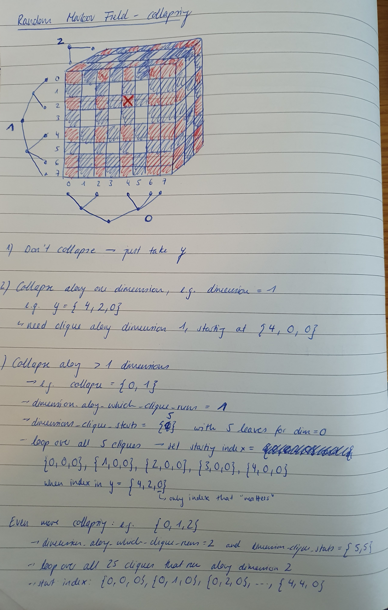

# This is Marco's daily open-notebook.

Today is 2025.01.24

# Updates from January
## Markov Random Field
With Madleina we continued working on the MRF. We are still working on the update of Y. This part is tricky
because the elements of Y vector are not independent for each dimension. We had to come up
with a couple of tricks to make it work. Right now it is difficult to create unit tests 
and we might test the model directly with simulations.

## Sirius database
This was a simple and quick thing to do. Pascal Pamrein created a database of in-silico reactions
of molecules in LOTUS with some enzymes-SMARTS. This created a database of about 3 million compounds.
I converted this database into a database for Sirius 6. We now hope that some of those "synthetic" molecules
will be present in future mass spec runs. 

## Cleaning LOTUS
Currently trying to find different ways of cleaning up lotus. I have added a filter for single atoms, 
double atoms, and NP-score likeness. This filters about 4% if the compounds.

## Species-hammer
Since LOTUS is highly biased, Luca told me to parse Pubmed in search of occurences of the molecules in lotus
and then use this information as a heuristic to estimate the presence of the molecules across the tree of life. 
So far, we have very little data so the output of Hammer will probably be quite bad. 

## Bachelor students
In order for the bachelor students to start nicely in February, I have to prepare some material for them: 
- I have to look into the molecules availble in the lab to see if we can create our own fake extract.
- I have to look at the different availble NP libraries to see if we there are some more or less cheap ones that we can use.
- I need to continue working on the Monorepo because it would be nice to have a working version for them 
to use so that they can go sample plants using the app.
