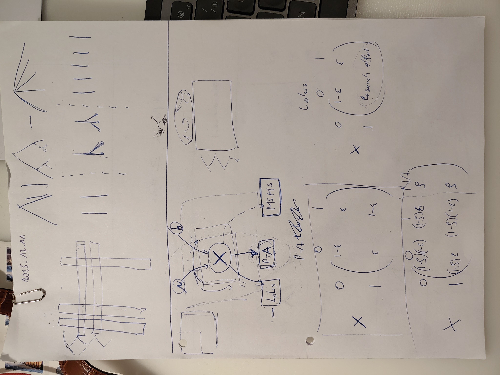
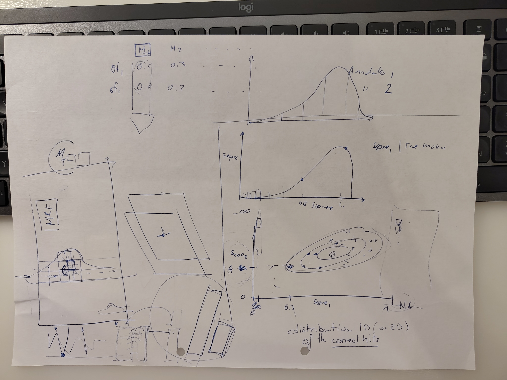

# Meeting with Daniel and Pierre-Marie
## Simple error model
Currently when compiling the Markov Field, we can either target LOTUS data or the simple error model.
I should change this so that it can both target LOTUS *and* the error model in order to add a layer of data to the model.
This would allow us to simulate some new data under the model and see if by adding data, the model predicts better. 

## Mass spectrometry data
For the mass spectrometry part, we decided that we don't want to develop our own annotation tool but to use the scores of the 
different existing annotation tools. 

The idea would be to evaluate what is the distribution of the scores of the true molecules for each annotation tool. Then in the model we feed the probability of the vector of scores given the molecule $$P(\overrightarrow{scores}| Molecule )$$. 

