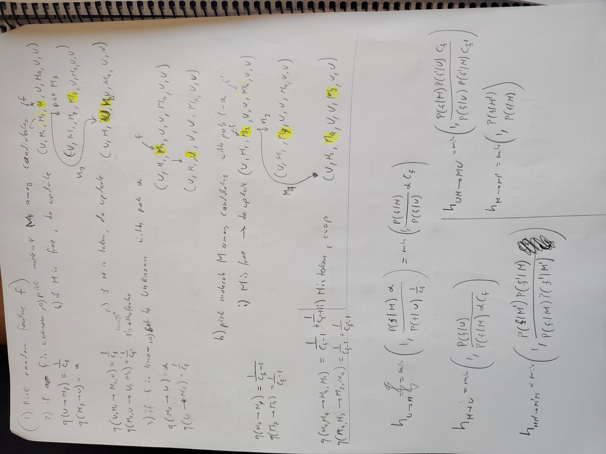

For all features $f$ : 
1. $f$ is unknown (assigned to the unknown molecule)
   1. pick molecule $M$ among candidates for that feature 
   2. if $M$ is free, do the update [$h_{U\rightarrow M}$](#unknown-to-molecule)
   3. if $M$ is taken, assign the feature that has molecule $M$ to unknown and assign $M$ to $f$ [$h_{UM\rightarrow MU}$](#swap-molecules-m-and-m-with-unknown)
2. if $f$ is known (assigned to a molecule)
   1. set to unknown with probability $\beta$ [$h_{M\rightarrow U}$](#molecule-to-unknown)
   2. pick molecule $M$ among candidates with probability $1-\beta$
      1. if $M$ is free, do the update [$h_{M\rightarrow M'}$](#molecule-m-to-molecule-m)
      2. if $M$ is taken, propose to swap the two molecules. [$h_{MM'\rightarrow M'M}$](#swap-molecules-m-and-m)

Below are defined the Hastings ratios for all the possible updates.

## Hastings ratios
With $c_f$ the number of candidate molecules for feature $f$ and $\beta$ the probability of setting a known feature to unknown.

### Unknown to molecule
$$h_{U\rightarrow M} = \min\left(1, \frac{P(f|M) \beta}{P(f|U) \frac{1}{c_f}}\right) = \min\left(1, \frac{P(f|M)}{P(f|U)} \beta c_f\right)$$

### Molecule to unknown
$$h_{M\rightarrow U} = \min\left(1, \frac{P(f|U)}{P(f|M) \beta c_f}\right)$$

### Molecule M to molecule M'
$$h_{M\rightarrow M'} = \min\left(1, \frac{P(f|M')}{P(f|M)}\right)$$

### Swap molecules M and M'
$$h_{MM'\rightarrow M'M} = \min\left(1, \frac{P(f|M')P(f'|M)}{P(f|M)P(f'|M')}\right)$$

### Swap molecules M and M' with unknown
$$h_{UM\rightarrow MU} = \min\left(1, \frac{P(f|M)P(f'|U)c_f}{P(f|U)P(f'|M)c_{f'}}\right)$$

