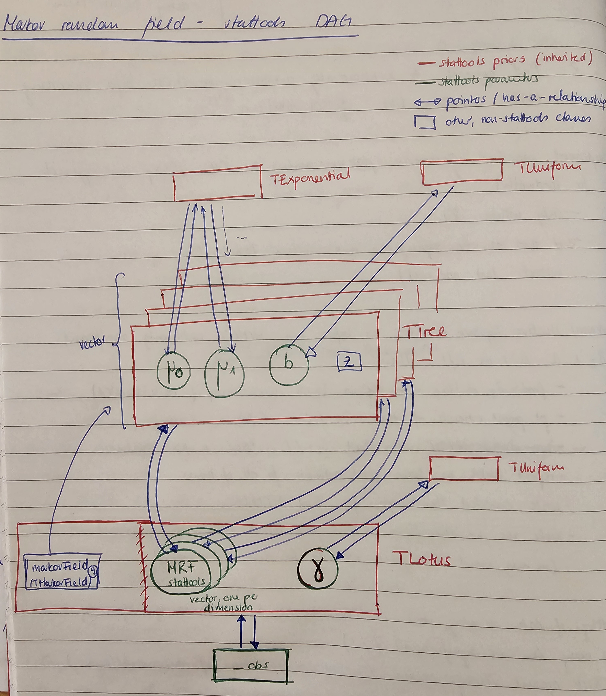

Today is the 6th March 2025. With Madleina we finished the implementation of the MRF model are currently running a couple of simulations to see if the model is working as expected.

### stattools DAG
Currently the model looks like this : 

### Model validation
To validate the model we are going to create two fake trees. One tree will consist of pairs of nodes and roots that are independent of each other. We are also going to set all branch length to the same value. The rate parameters $\mu_0$ and $\mu_1$ are set to $0.5$. The other tree will consist of only one root with multiple leaves. We will then set all the branch length to same values and set the rate parameters to a arbitrary value. We will then run the model, and calculate the probability of going from the root to the node (for the second tree). This should result in the same values than the rate matrix.

## Questions
- What is the 0 in `using TypeBinnedBranchLengths = coretools::UnsignedInt8WithMax<0>;` ? -> It is just some stattools internal thing. 
