Here we test if the parameters of the model can be estimated given the data.


This was done in the `single_root` directory with the following parameters: 

```bash
../../build/acol simulate \
    --tree_species species.txt \
    --tree_molecules molecules.txt \
    --num_iterations 100000 \
    --species_branch_lengths acol_input_simulated.txt \
    --species_var_log_nu acol_input_simulated.txt \
    --species_mean_log_nu acol_input_simulated.txt \
    --species_log_nu acol_input_simulated.txt \
    --species_alpha acol_input_simulated.txt \
    --molecules_branch_lengths acol_input_simulated.txt \
    --molecules_var_log_nu acol_input_simulated.txt \
    --molecules_mean_log_nu acol_input_simulated.txt \
    --molecules_log_nu acol_input_simulated.txt \
    --molecules_alpha acol_input_simulated.txt \
    --numThreads 1 \
    --write_Y \
    --write_Z \
    --write_joint_log_prob_density \
    --write_Y_trace \
    --write_Z_trace \
    --fixedSeed 456284939 \
```

# Molecules
## Molecules $\alpha$
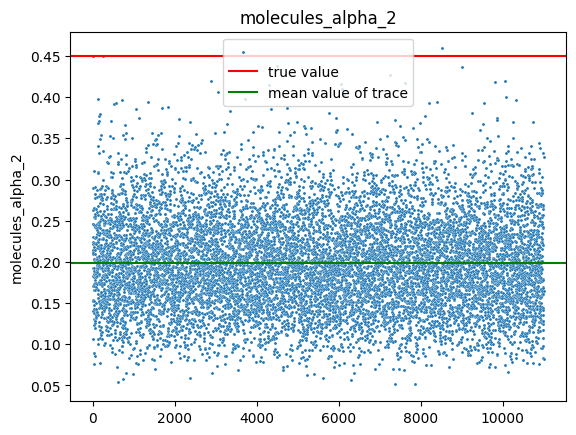
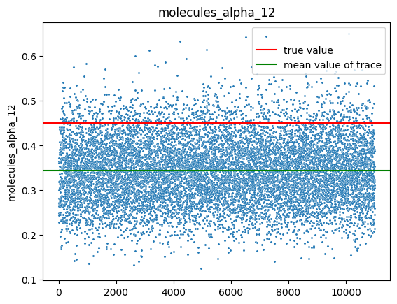

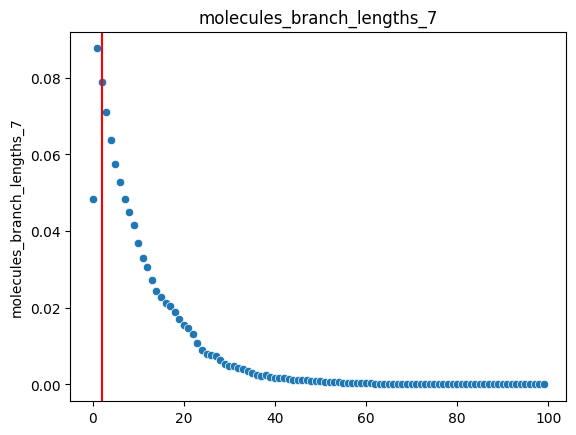
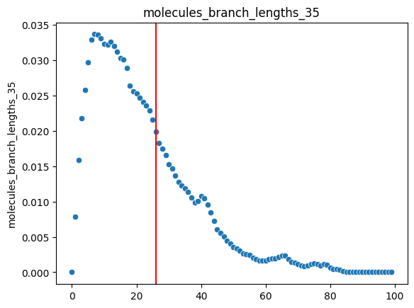

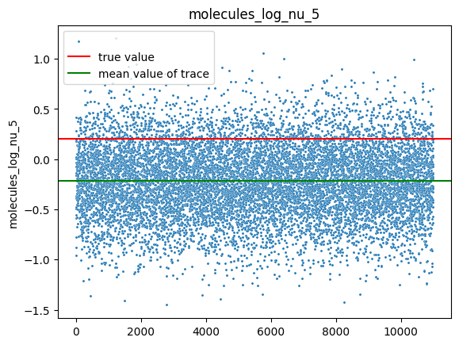
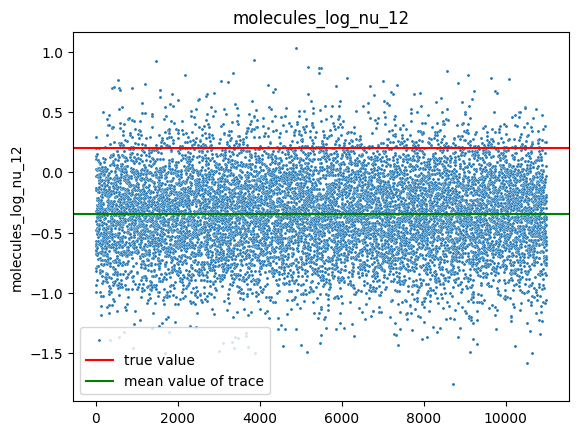

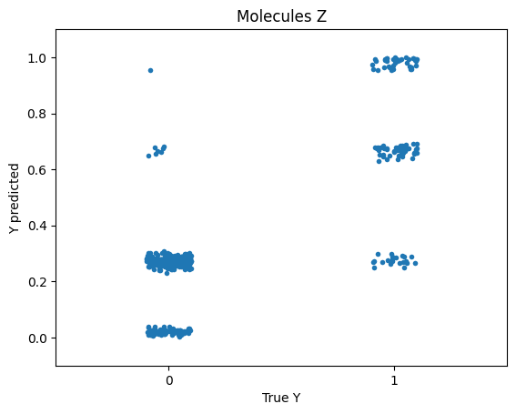


# Species
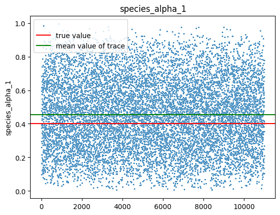
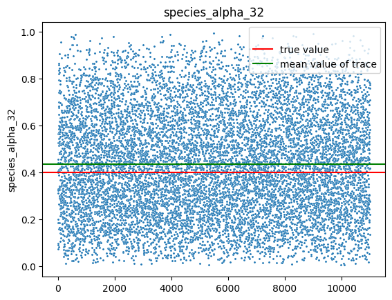

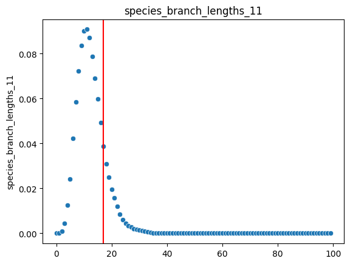
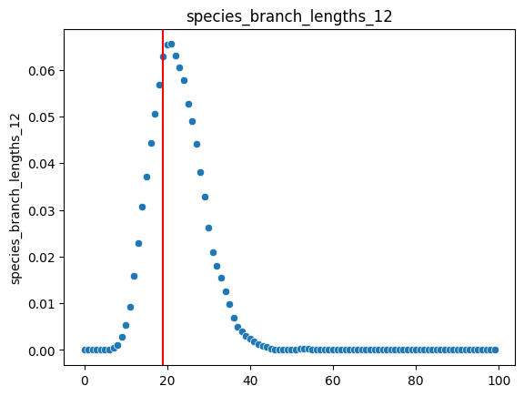

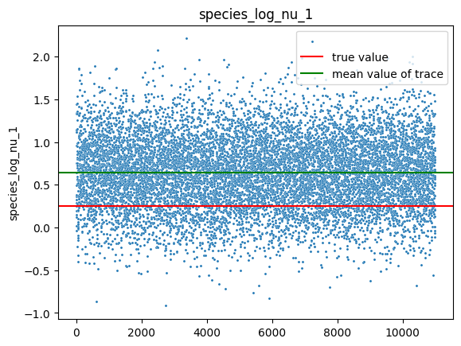
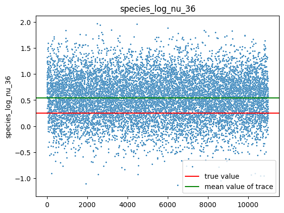

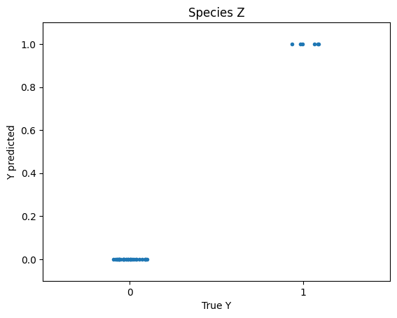


# And finally Y
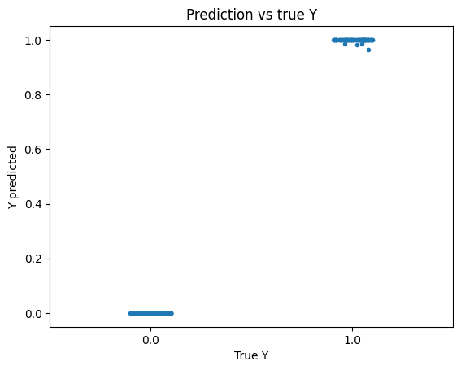